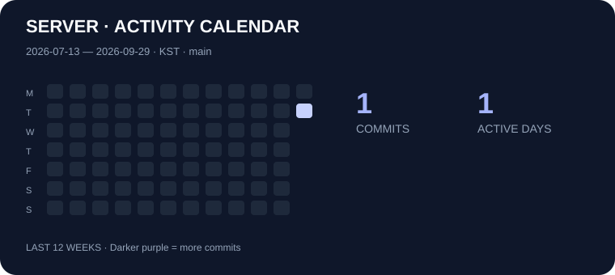

# 📚 SOPT 39th · 김진웅 Server 과제

매주 학습한 구현하고 기록합니다.

---

## ✅ 주차별 과제 제출

- [X] 1주차 과제 제출
- [ ] 2주차 과제 제출
- [ ] 3주차 과제 제출
- [ ] 4주차 과제 제출
- [ ] 5주차 과제 제출
- [ ] 6주차 과제 제출
- [ ] 7주차 과제 제출
- [ ] 8주차 과제 제출

## 📝 과제 기록

| 주차 | 학습 주제 | 과제 이슈 | 제출 PR |
| :---: | --- | :---: | :---: |
| 1주차 | 객체지향 설계 원칙을 적용한 게시판의 역할·책임 분리와 레이어드 아키텍처 구현 | 없음 | ✅ |
| 2주차 | 작성 예정 | — | — |
| 3주차 | 작성 예정 | — | — |
| 4주차 | 작성 예정 | — | — |
| 5주차 | 작성 예정 | — | — |
| 6주차 | 작성 예정 | — | — |
| 7주차 | 작성 예정 | — | — |
| 8주차 | 작성 예정 | — | — |

## 🔎 최근 활동

- [💻 최근 커밋 확인하기](https://github.com/39-play-sopt-server/jinwoong.kim/commits)
- [📝 최근 등록한 이슈 확인하기](https://github.com/39-play-sopt-server/jinwoong.kim/issues?q=is%3Aissue%20sort%3Acreated-desc)
- [🔥 진행 중인 이슈 확인하기](https://github.com/39-play-sopt-server/jinwoong.kim/issues?q=is%3Aissue%20is%3Aopen)
- [✅ 완료한 이슈 확인하기](https://github.com/39-play-sopt-server/jinwoong.kim/issues?q=is%3Aissue%20is%3Aclosed)
- [🚀 제출한 PR 확인하기](https://github.com/39-play-sopt-server/jinwoong.kim/pulls?q=is%3Apr%20sort%3Acreated-desc)
## 📅 과제 활동 달력

> 이 저장소의 커밋 기록을 기준으로 자동 갱신됩니다.

## 🛠 Tech Stack

